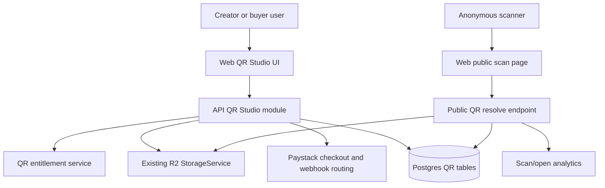
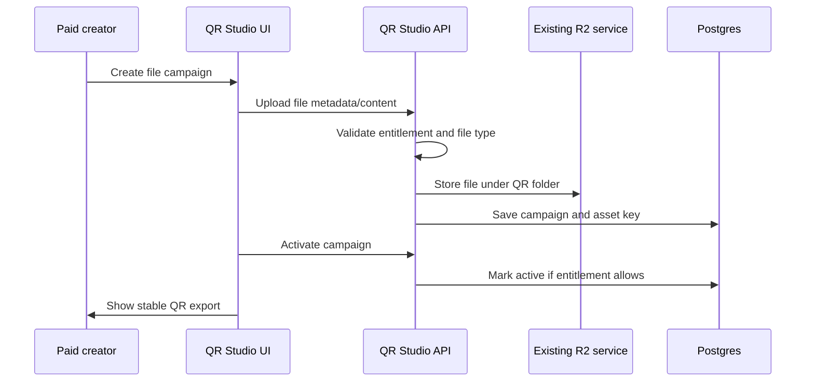
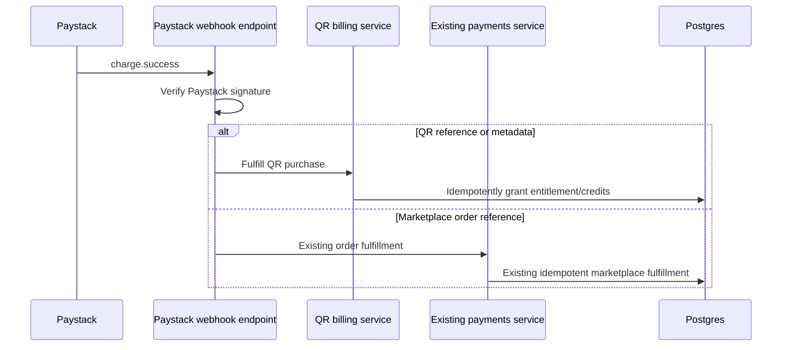

# QR Studio - Plan

## Goal Capsule

| Field | Value |
|---|---|
| Objective | Add QR Studio as a separately monetized premium module for creators and buyers, starting with hosted document/file QR campaigns and expanding Pro to richer content options. |
| Product authority | The user-settled decisions in this conversation govern pricing, access, branding, R2 storage, and Paystack payment scope. |
| Execution profile | Deep feature plan because the work touches payments, uploads, public scan access, entitlements, analytics, and creator dashboard UX. |
| Stop conditions | Stop if Paystack QR payments cannot be isolated from marketplace order fulfillment, if R2 cannot issue safe per-scan file access, or if existing checkout/download flows regress. |
| Tail ownership | Implementation must finish with API, web, database, and payment regression coverage before QR Studio is exposed in navigation. |

---

## Product Contract

### Summary

QR Studio gives CreatorPlus users a paid tool for creating branded dynamic QR campaigns.
The first supported buyer-visible value is instant access to hosted PDF/file content through a CreatorPlus-branded scan page.
The Pro plan expands the tool into a richer campaign studio with more content types, saved branding, advanced exports, and analytics.

### Problem Frame

A creator wants to host a PDF and distribute it with a designed QR code.
The platform can monetize this as a premium add-on without changing the normal marketplace product purchase flow.
The safest product shape is a separate QR Studio module that uses existing identity, storage, and payment infrastructure while keeping QR entitlements independent from product orders, wallet credits, commissions, and downloads.

### Actors

- A1. Creator: creates QR campaigns, uploads assets, designs branded QR codes, pays for single campaigns, packs, or Pro access, and views analytics.
- A2. Buyer/user: can also buy QR Studio access later, but the MVP UI primarily targets creators because the initial demand is creator-led distribution.
- A3. Scanner: anonymous visitor who scans a code and immediately reaches a branded landing/file access page.
- A4. Admin: can inspect QR plans, payments, campaign abuse reports, and storage/payment health without manually granting ordinary access.

### Requirements

**Plans, pricing, and access**

- R1. QR Studio must have no free plan, free draft creation, free activation, free export, or watermark on any paid output.
- R2. Single QR Campaign costs ₦1,500 one-time and grants one active QR campaign for 12 months.
- R3. Creator QR Pack costs ₦5,000 one-time and grants five active QR campaigns for 12 months.
- R4. Pro QR Studio launches as a non-auto-renewing Pro pass at ₦2,000 per month or ₦20,000 per year and grants up to 20 active campaigns while the paid period is active.
- R5. All plans must support creator branding on the QR design and the scan experience.
- R6. Pro must include deeper branding controls than one-time plans, including saved brand kit behavior and richer design presets.
- R7. QR Studio entitlements must be separate from marketplace subscriptions, product purchases, wallet balance, product commissions, affiliate commissions, downloads, and licenses.

**Campaign behavior**

- R8. Each QR campaign must be dynamic: the printed QR points to a stable CreatorPlus URL that can resolve to updated content without regenerating the QR image.
- R9. Scanning a QR must open a branded landing page by default.
- R10. Pro users may switch a campaign to direct-open behavior, where scan traffic goes straight to the selected destination when safe.
- R11. Hosted file campaigns must provide immediate access through a clear open/download action.
- R12. Campaign owners must be able to replace or update hosted files without changing the printed QR URL.
- R13. Campaigns must have owner-controlled status: draft, active, paused, expired, and archived.
- R14. Draft, paused, archived, expired, or over-entitlement campaigns must not expose hosted private file URLs.

**Content options**

- R15. Single and Pack plans must launch with hosted PDF/file campaigns and link campaigns.
- R16. Pro launch scope must support PDF/document, image/gallery, website/custom link, CreatorPlus product page, creator profile, WhatsApp chat, social link hub, and text note content types.
- R17. Uploaded QR assets must use the existing Cloudflare R2 storage path and validation posture.
- R18. Link-like content must be validated so public scan pages cannot become phishing, script, or unsafe redirect surfaces.

**Design and export**

- R19. QR designs must prioritize scan reliability with quiet zone preservation, high contrast defaults, and high error correction for logo-branded codes.
- R20. Users must be able to export QR codes for digital use and print-ready use.
- R21. The product must warn when a design choice could reduce scan reliability.

**Analytics and administration**

- R22. The system must record scan and download/open counts per campaign.
- R23. Analytics must include time-series totals and safe aggregate dimensions such as device class, browser family, referrer, and coarse location when available.
- R24. Analytics must not store raw IP addresses for ordinary reporting.
- R25. Admins need enough visibility to support payment, abuse, and storage issues without seeing private file contents by default.

**Safety, privacy, and abuse controls**

- R26. Public campaign codes must be cryptographically random, high entropy, and resistant to enumeration.
- R27. Public scan and file-open endpoints must use rate limits, uniform inactive/not-found responses, and abuse monitoring for repeated code probes.
- R28. Uploaded public-distribution files must pass QR-specific safety controls before activation, using a `PENDING_SCAN`, `APPROVED`, or `BLOCKED` asset lifecycle with production fail-closed behavior until a scanner or approved manual path marks the asset approved.
- R29. Signed R2 access responses must use a short maximum TTL, no-store response caching, signed URL log redaction, safe filenames, and no referrer leakage from CreatorPlus scan pages.
- R30. Direct-open redirects must canonicalize destinations server-side, allow only safe public destinations, and disclose the destination domain when leaving CreatorPlus.
- R31. Admin QR access must be least-privilege, redact sensitive payment/provider/file fields by default, and audit support/admin actions with reason codes.
- R32. Video link, audio file/link, contact card, event/ticket page, coupon/promo, location/map, and email/SMS action content types are deferred Pro expansions unless implementation discovers they are trivial variants of the launch validators.
- R33. QR Studio dashboard information architecture must define unpaid, paid-empty, paid-active, expired, and Pro-over-limit states before UI implementation.
- R34. QR checkout UX must define unauthenticated, unpaid, checkout-starting, Paystack-return-pending, payment-failed, canceled, webhook-delayed, paid-active, expired, Pro-over-limit, and support-needed states.
- R35. Campaign builder UX must follow choose content type, upload or enter destination, edit landing/branding, preview, activate, and export steps with recovery paths for upload, validation, activation, replacement, and exit states.
- R36. Scan behavior controls must default to Landing Page, show Direct Open only as a Pro-gated setting, block unsafe destinations inline, and render a branded unavailable page for inactive, expired, unsafe, or over-entitlement campaigns.
- R37. QR export UX must define digital and print-ready output formats, warning severity, disabled states, generation failure, success/download state, and warning acknowledgement behavior.
- R38. QR Studio dashboard, builder, designer, export controls, and public scan pages must meet mobile, keyboard, screen-reader, visible-focus, color-contrast, upload-announcement, error-announcement, and touch-target expectations.
- R39. QR private asset APIs must never return or persist public `R2_PUBLIC_URL` URLs, raw R2 keys in public/admin responses, or signed query strings outside the immediate file-open response.
- R40. QR analytics may use raw request data only in memory during request handling; persisted referrer must be origin-only, user agent must be coarse-bucketed, and IP must be discarded after coarse geo or non-linkable hash derivation.
- R41. QR checkout and QR webhook routing must be API-gated so disabled QR paths cannot change existing marketplace Paystack webhook behavior.

### Key Flows

- F1. Purchase single campaign
  - **Trigger:** A creator selects Single QR Campaign.
  - **Actors:** A1.
  - **Steps:** The system starts a Paystack checkout, verifies the Paystack webhook, grants one QR campaign credit, and returns the user to QR Studio.
  - **Covered by:** R1, R2, R5, R7.
- F2. Create hosted PDF campaign
  - **Trigger:** A paid creator starts a new file campaign.
  - **Actors:** A1.
  - **Steps:** The creator uploads a PDF/file to R2, sets title/description/branding, previews the landing page, activates the campaign, and exports the QR code.
  - **Covered by:** R8, R9, R11, R12, R17, R19, R20.
- F3. Scan hosted file QR
  - **Trigger:** A scanner opens the stable QR URL.
  - **Actors:** A3.
  - **Steps:** The public scan route records a privacy-safe scan event, resolves the active campaign, renders the branded page, and issues a short-lived signed R2 download/open URL only when the scanner requests the file.
  - **Covered by:** R9, R11, R14, R22, R24.
- F4. Pro content campaign
  - **Trigger:** A Pro user creates a non-file campaign.
  - **Actors:** A1.
  - **Steps:** The creator picks a Pro-only content type, enters required fields, validates preview behavior, activates the campaign, and exports the QR code.
  - **Covered by:** R4, R6, R10, R16, R18.
- F5. Entitlement expiry
  - **Trigger:** A one-time campaign reaches 12 months or a Pro paid period ends.
  - **Actors:** A1, A3.
  - **Steps:** The system prevents draft creation and campaign activation beyond entitlement, marks affected campaigns expired or over-limit, and keeps scan pages from exposing private hosted files.
  - **Covered by:** R2, R3, R4, R13, R14.

### Acceptance Examples

- AE1. Covers R2, R8, R11. Given a creator has bought one Single QR Campaign, when they upload a PDF and activate the campaign, then the campaign has one stable QR URL and scanning it shows a branded access page with an open/download action.
- AE2. Covers R3, R7. Given a creator buys the Creator QR Pack, when Paystack confirms payment, then five QR campaign credits are granted without creating a marketplace order, download, wallet credit, commission, affiliate conversion, or license.
- AE3. Covers R4, R16. Given a creator has active Pro QR Studio pass access, when they create campaigns, then they can create up to 20 active campaigns using Pro launch content types until the paid period ends.
- AE4. Covers R10, R14. Given a Pro user enables direct-open for an active file campaign, when the campaign later expires, then the QR URL no longer redirects to the R2 file.
- AE5. Covers R17, R24, R29. Given a scanner opens a hosted PDF campaign, when the event is recorded, then uploaded content remains in R2, the signed URL is short-lived and no-store, and analytics store aggregate metadata without raw IP.
- AE6. Covers R19, R21. Given a creator adds a logo or low-contrast colors, when they preview/export the QR, then the system uses high error correction and warns about choices that may hurt scan reliability.
- AE7. Covers R26, R27. Given an anonymous client probes random QR codes repeatedly, when codes are invalid, paused, archived, draft, expired, or over-entitlement, then responses do not reveal which state exists and abuse controls limit the probing.
- AE8. Covers R28. Given a creator uploads a file that is pending or fails QR safety screening, when they try to activate the campaign, then activation is blocked and the scan page does not expose the file.
- AE9. Covers R30. Given a Pro campaign uses direct-open to an external site, when a scanner opens it, then the destination is canonicalized, unsafe destinations are rejected, and non-CreatorPlus destinations are disclosed before or during redirect.
- AE10. Covers R34, R41. Given Paystack returns before the webhook arrives, when the user lands back in QR Studio, then the UI shows a pending verification state and does not grant entitlement until the QR webhook is fulfilled.
- AE11. Covers R39. Given a QR private file is uploaded, when owner, admin, and public APIs respond, then they do not include `R2_PUBLIC_URL`, raw private keys, or signed query strings except from the immediate file-open response.
- AE12. Covers R40. Given a scan request includes IP, full user agent, and referrer with query parameters, when QR analytics persist the event, then no raw IP, full user agent, full referrer query, or full referrer fragment is stored.

### Scope Boundaries

In scope:

- New QR Studio premium module for creators and future buyer access.
- R2-backed uploads for QR content assets.
- Paystack-only QR Studio payments.
- Dynamic stable QR URLs and branded scan pages.
- Campaign analytics and owner/admin management.
- Regression-safe integration with existing auth, storage, and payment services.

Out of scope:

- Free QR generation.
- Watermarked QR output.
- Marketplace product checkout changes except shared Paystack webhook routing where required.
- Wallet-funded QR purchases.
- Creator revenue share, commissions, affiliate payouts, refunds into creator wallets, or product download grants for QR Studio purchases.
- Public search/catalog exposure for QR campaigns.
- Auto-renewing Paystack subscriptions, cancellation flows, failed renewal dunning, grace periods, and plan switching beyond buying a new Pro pass.

### Deferred to Follow-Up Work

- Bulk QR generation.
- Custom creator QR subdomains.
- Password-gated or email-capture scan pages.
- Expiring scan links per visitor.
- Team seats for business accounts.
- Auto-renewing Paystack subscriptions after the Pro pass proves demand.
- Video link, audio file/link, contact card, event/ticket page, coupon/promo, location/map, and email/SMS action Pro content types when they are not trivial variants of launch validators.
- Admin moderation queues, report triage, reviewer assignment, notifications, appeals, moderation history, and full abuse workflows beyond basic inspection plus one audited pause/archive action.

---

## Planning Contract

### Key Technical Decisions

- KTD1. **Build QR Studio as a separate bounded domain.** Create dedicated QR Studio API, database models, UI routes, and entitlement logic instead of extending Product, Order, Download, License, Commission, or Wallet behavior. This protects the existing marketplace and satisfies R7.
- KTD2. **Use existing R2 storage service for every QR upload.** Reuse `apps/api/src/storage/storage.service.ts` and `apps/api/src/common/file-validation.ts`, with QR-specific folders and stricter per-content-type validation where required. This satisfies R17 and avoids a second storage path.
- KTD3. **Use Paystack for QR Studio payments with isolated fulfillment.** Add QR payment records and route Paystack webhook events by QR-specific metadata/reference before marketplace order fulfillment runs. This satisfies R7 and the user-settled Paystack requirement.
- KTD4. **Serve files through CreatorPlus scan routes, not public raw R2 links.** Scan pages should issue short-lived signed R2 URLs only after campaign state and entitlement checks pass. This satisfies R11, R14, and R24.
- KTD5. **Generate QR images from stable CreatorPlus URLs.** The encoded value should be the campaign's permanent scan URL, not the file URL or destination URL. This enables dynamic edits and supports R8.
- KTD6. **Prefer internal QR generation over third-party image services.** Existing 2FA pages use an external QR image endpoint, but QR Studio should generate export assets inside the app to avoid leaking campaign URLs and to support branded exports. This supports R19 and R20.
- KTD7. **Record analytics as append-only scan/open events plus aggregates.** Store event facts needed for counts and safe analytics, but hash or truncate sensitive request data and avoid raw IP storage. This satisfies R22 through R24.
- KTD8. **Gate Pro content types through entitlements, not hidden UI alone.** The API must reject Pro-only content creation when the user lacks active Pro access. This satisfies R4, R6, and R16.
- KTD9. **Keep QR offers as versioned code/config definitions at launch.** The agreed four offers are fixed product decisions, so the first implementation should avoid a runtime-editable plan catalog unless implementation uncovers an immediate admin-editing or historical-versioning need. Snapshot purchased offer details onto QR payments and entitlements.
- KTD10. **Launch Pro as prepaid passes, not auto-renewing subscriptions.** Existing subscription billing is Stripe-shaped, while the user requires Paystack for this feature. The safe launch contract is a monthly or yearly Paystack-paid access period with manual renewal.
- KTD11. **Create a QR-private storage contract on top of existing R2 service.** The current storage service returns public URLs for ordinary uploads, so QR private asset APIs must return keys internally and expose files only through checked, signed, short-lived file-open responses.
- KTD12. **Classify Paystack webhooks before fulfillment.** A shared Paystack webhook endpoint must verify the signature, classify the event by QR or marketplace ownership, and dispatch to exactly one fulfillment service before any order-shaped logic runs.
- KTD13. **Gate hosted file activation on asset approval.** QR file uploads start as `PENDING_SCAN`; production activation and file-open access require `APPROVED`; `BLOCKED` assets show creator/admin remediation and never reach scanners. Development may use an explicit local auto-approve setting, but production must fail closed.

### UI State Contracts

| Surface | Required states |
|---|---|
| Dashboard IA | Unpaid pricing gate first; paid-empty first-campaign CTA; paid-active entitlement status, create CTA, campaign list grouped by active/draft/paused/expired, and analytics secondary; expired and Pro-over-limit renewal or upgrade CTA before creation/export. |
| Pricing/checkout gate | Unauthenticated, unpaid, checkout-starting, Paystack-return-pending, payment-failed, canceled, webhook-delayed, paid-active, expired, Pro-over-limit, and support-needed states. |
| Campaign builder | Choose content type, upload or enter destination, edit landing/branding, preview, activate, and export; include loading, empty, invalid file/type, unsafe URL, upload failed, draft saved, activation blocked, replace-file confirmation, and exit behavior. |
| Scan behavior setting | Landing Page is default; Direct Open is visible only as a Pro-gated setting; non-Pro sees upgrade copy; unsafe destinations block inline; inactive, expired, unsafe, or over-entitlement scans show a branded unavailable page. |
| Export flow | Disabled without entitlement or active campaign; preview generating; warning but export allowed; blocking scan-risk error; export failed; export success/download; digital export and print-ready export choices are explicit. |
| Accessibility/responsive | Mobile-first scanner page; small-screen campaign list; keyboard-reachable controls; visible focus; labelled icon buttons; upload/error announcements; contrast checks; minimum touch targets. |

### High-Level Technical Design

### Data Model Direction

Add QR Studio models in `packages/database/prisma/schema.prisma` and a matching migration.
The exact field names may change during implementation, but the plan expects these concepts:

- QR offer definitions: versioned application definitions for Single, Pack, Pro Monthly, and Pro Yearly, with the purchased offer code, price, and limits snapshotted onto QR payment or entitlement records.
- QR entitlement: user's campaign credits, Pro paid period, max active campaigns, and source payment.
- QR payment: Paystack reference, provider response, amount, currency, status, and fulfilled-at marker.
- QR campaign: owner, stable slug/code, content type, status, landing/direct mode, branding, plan source, expiry, and timestamps.
- QR asset: R2 file key, original filename, MIME type, size, checksum when available, safety status, safety reason, scanner metadata, and relation to a campaign.
- QR scan/open event: campaign, event kind, timestamp, request metadata hash, referrer, user agent classification, and coarse location.

### Assumptions

- Paystack remains the only QR Studio payment provider for this feature.
- QR Studio one-time plans expire after 12 months unless renewed.
- Pro launches as paid access periods renewed through Paystack checkout; auto-renewing Paystack subscription behavior is deferred.
- Buyer-facing QR creation can use the same module after creator-first MVP, but creator dashboard placement is the first UI target.
- R2 public URL configuration may continue to exist for public assets, but QR private hosted files should be delivered through signed URLs from CreatorPlus routes.

### Risks & Dependencies

| Risk | Mitigation |
|---|---|
| Paystack QR webhook could break existing marketplace order webhooks. | Route QR references/metadata before order fulfillment and add regression tests for both QR and marketplace Paystack events. |
| Public scan pages could expose private R2 file URLs after campaign expiry. | Resolve signed file URLs only after status, ownership, expiry, and entitlement checks pass. |
| QR uploads could allow unsafe hosted content. | Reuse existing validation, keep HTML blocked, add QR-specific allowlists by content type, and require approved asset safety status before activation. |
| Pro content types could be bypassed through direct API calls. | Enforce entitlements in service methods and controller tests, not only in UI. |
| Scan analytics could collect too much personal data. | Store aggregates and hashed/truncated request signals only; do not store raw IP. |
| QR design customization could reduce scan reliability. | Generate with high error correction for branded QR codes, preserve quiet zones, validate contrast, and add warning states. |
| Public QR codes could be enumerated. | Use high-entropy random codes, rate limits, uniform inactive/not-found responses, and abuse monitoring. |
| Direct-open URLs could become branded phishing redirects. | Canonicalize destinations, reject unsafe/private targets, and disclose external domains. |
| Admin support views could overexpose sensitive data. | Redact sensitive fields by default and require least-privilege permissions plus audited reason codes. |
| Current R2 upload methods return public URLs. | Add QR-private asset service behavior that stores keys internally and never returns public R2 URLs for private campaign assets. |
| Existing Paystack provider assumes order checkout metadata. | Extend the provider contract or add a QR checkout adapter so reference purpose, prefix, and metadata are caller-owned before webhook classification. |

### Sources & Research

- Existing R2 storage pattern: `apps/api/src/storage/storage.service.ts`, `apps/api/src/storage/storage.controller.ts`, `apps/api/src/common/file-validation.ts`.
- Existing product file delivery pattern: `apps/api/src/products/products.service.ts`, `apps/api/src/downloads/downloads.service.ts`.
- Existing Paystack pattern: `apps/api/src/payments/providers/paystack.provider.ts`, `apps/api/src/payments/payments.service.ts`, `apps/api/src/payments/payments.controller.ts`, `apps/api/src/settings/settings.service.ts`.
- Existing subscription/credit caution: `apps/api/src/billing/billing.service.ts` currently uses Stripe for subscriptions and credit packs, so QR Studio should not rely on it for Paystack fulfillment without an explicit QR billing extension.
- Cloudflare R2 presigned URL docs: `https://developers.cloudflare.com/r2/api/s3/presigned-urls/`.
- Cloudflare R2 public bucket docs: `https://developers.cloudflare.com/r2/buckets/public-buckets/`.
- Paystack transaction docs: `https://paystack.com/docs/api/transaction/`.
- Paystack webhook docs: `https://paystack.com/docs/payments/webhooks/`.

---

## Implementation Units

### U1. Add QR Studio database contract

- **Goal:** Add QR Studio persistence without modifying existing marketplace order, payment, download, commission, wallet, or license models.
- **Requirements:** R1 through R8, R13, R14, R22 through R31.
- **Dependencies:** None.
- **Files:**
  - `packages/database/prisma/schema.prisma`
  - `packages/database/prisma/migrations/<timestamp>_add_qr_studio/migration.sql`
  - `packages/database/prisma/seed.ts`
  - `apps/api/test/helpers.ts`
- **Approach:**
  1. Add QR entitlement, payment, campaign, asset, and event models.
  2. Relate QR records to `User` and optionally to `CreatorProfile` without making creator profile mandatory for future buyer access.
  3. Add indexes for owner dashboards, public code lookup, Paystack reference lookup, entitlement expiry, campaign analytics, and abuse monitoring.
  4. Snapshot purchased offer code, price, period, credit count, and active campaign limit on QR payment or entitlement rows.
- **Patterns to follow:** Use enum and relation style from `packages/database/prisma/schema.prisma`; use existing money snapshot style from order/payment records.
- **Test scenarios:**
  - Creating the migration adds QR tables without changing existing `orders`, `payments`, `downloads`, `wallets`, `commissions`, `license_keys`, or `tickets` columns.
  - QR campaign public code is unique and indexed.
  - QR campaign public code generation produces high-entropy non-sequential values.
  - QR payment Paystack reference is unique and indexed.
  - Deleting a user cascades or restricts QR records according to the chosen retention rule without affecting product/order data.
- **Verification:** Prisma generation succeeds and the migration applies cleanly on an empty database and an existing development database.

### U2. Build QR entitlement and plan service

- **Goal:** Enforce paid access, campaign credits, Pro limits, and expiry rules server-side.
- **Requirements:** R1 through R7, R13, R14, R16, R32.
- **Dependencies:** U1.
- **Files:**
  - `apps/api/src/qr-studio/qr-studio.module.ts`
  - `apps/api/src/qr-studio/qr-entitlements.service.ts`
  - `apps/api/src/qr-studio/qr-offer-definitions.ts`
  - `apps/api/src/qr-studio/dto/qr-plan.dto.ts`
  - `apps/api/src/qr-studio/qr-entitlements.service.spec.ts`
- **Approach:**
  1. Model one-time campaign credits and Pro active periods as QR entitlements.
  2. Count only active campaigns against entitlement limits.
  3. Reject activation when credits are exhausted, Pro is inactive, or active campaign count exceeds 20.
  4. Require paid entitlement before draft campaign creation, activation, export, or public exposure.
- **Patterns to follow:** Creator ownership checks from `apps/api/src/coupons/coupons.service.ts`; active status gates from `apps/api/src/events/events.service.ts`.
- **Test scenarios:**
  - A user with no paid QR entitlement cannot create a draft campaign or activate a campaign.
  - A Single entitlement activates one campaign and rejects a second active campaign.
  - A Pack entitlement activates five campaigns and rejects the sixth active campaign.
  - A Pro entitlement activates 20 campaigns and rejects the 21st active campaign.
  - Expired one-time and Pro entitlements prevent private file access.
  - Pro launch content types are rejected when the user has only Single or Pack access.
  - Deferred Pro content types are not exposed as active API creation options unless implemented as trivial launch-validator variants.
- **Verification:** Unit tests prove entitlement decisions without depending on web UI state.

### U3. Add Paystack-only QR billing

- **Goal:** Sell QR plans through Paystack and fulfill QR entitlements idempotently without disturbing marketplace order payments.
- **Requirements:** R1 through R7.
- **Dependencies:** U1, U2.
- **Files:**
  - `apps/api/src/qr-studio/qr-billing.service.ts`
  - `apps/api/src/qr-studio/qr-billing.controller.ts`
  - `apps/api/src/qr-studio/dto/qr-billing.dto.ts`
  - `apps/api/src/payments/payments.controller.ts`
  - `apps/api/src/payments/paystack-webhook-classifier.ts`
  - `apps/api/src/payments/providers/paystack.provider.ts`
  - `apps/api/src/payments/providers/payment-provider.interface.ts`
  - `apps/api/src/payments/payments.service.ts`
  - `apps/api/src/qr-studio/qr-billing.service.spec.ts`
  - `apps/api/src/payments/payments.service.spec.ts`
- **Approach:**
  1. Extend the Paystack provider interface or add a QR Paystack adapter so checkout callers provide purpose, reference prefix, success URL, cancel URL, and metadata.
  2. Add QR checkout creation that initializes Paystack transactions with QR-specific reference prefix and metadata.
  3. Store QR payment rows before redirecting the user to Paystack.
  4. Classify Paystack webhook events by verified reference ownership before any fulfillment service runs.
  5. Route QR references/metadata into QR billing fulfillment.
  6. Preserve existing marketplace order webhook behavior for non-QR references.
  7. Make QR fulfillment idempotent by atomically claiming an unfulfilled QR payment before granting credits or Pro access.
- **Patterns to follow:** Paystack initialization and signature verification from `apps/api/src/payments/providers/paystack.provider.ts`; idempotent fulfillment from `apps/api/src/payments/payments.service.ts`.
- **Test scenarios:**
  - QR checkout creates a Paystack transaction for ₦1,500, ₦5,000, ₦2,000, or ₦20,000 according to selected plan.
  - Paystack `charge.success` with QR metadata grants the correct entitlement exactly once.
  - Duplicate QR webhook does not grant duplicate campaign credits or extend Pro twice.
  - Paystack amount mismatch does not fulfill QR entitlement.
  - Existing marketplace Paystack webhook still marks a marketplace order paid and does not route to QR billing.
  - QR-looking reference without a QR payment row does not fall through to marketplace fulfillment.
  - Marketplace-looking reference with QR metadata does not fulfill either domain until ownership is unambiguous.
  - Failed QR charge marks QR payment failed without touching marketplace orders.
  - QR refund events do not trigger creator wallet or commission reversal.
  - QR checkout and QR webhook routes no-op safely when the QR feature flag is disabled.
  - Unknown Paystack reference is ignored or rejected according to the existing webhook policy without fulfilling anything.
- **Verification:** API tests include both QR and marketplace Paystack webhook fixtures.

### U4. Add QR campaign management API

- **Goal:** Let paid users create, update, activate, pause, archive, replace content, and view their QR campaigns.
- **Requirements:** R8 through R18, R22 through R31.
- **Dependencies:** U1, U2.
- **Files:**
  - `apps/api/src/qr-studio/qr-campaigns.controller.ts`
  - `apps/api/src/qr-studio/qr-campaigns.service.ts`
  - `apps/api/src/qr-studio/dto/qr-campaign.dto.ts`
  - `apps/api/src/qr-studio/qr-content-validation.ts`
  - `apps/api/src/qr-studio/qr-campaigns.service.spec.ts`
- **Approach:**
  1. Add owner-only CRUD endpoints for campaigns.
  2. Validate content fields by launch content type and redirect safety policy.
  3. Gate activation through U2.
  4. Store direct-open mode only for Pro-eligible users.
  5. Keep deferred Pro content types out of active creation unless they reuse an existing launch validator safely.
  6. Keep campaign public code stable across edits.
- **Patterns to follow:** Controller/service style from `apps/api/src/events/events.controller.ts` and `apps/api/src/events/events.service.ts`; creator scoping from `apps/api/src/coupons/coupons.service.ts`.
- **Test scenarios:**
  - A campaign owner can create a draft campaign.
  - A non-owner cannot update, activate, pause, archive, or view owner-only details.
  - Activation fails without entitlement and succeeds with entitlement.
  - Campaign public code remains unchanged after destination or file replacement.
  - Invalid URLs, malformed WhatsApp numbers, unsafe redirect schemes, and missing required fields are rejected.
  - External direct-open URLs reject userinfo, localhost, private IPs, suspicious encoded redirects, and non-HTTPS schemes.
  - Direct-open mode is rejected for non-Pro users.
- **Verification:** Controller/service tests prove ownership, validation, status transitions, and entitlement enforcement.

### U5. Add R2-backed QR asset upload

- **Goal:** Store all QR uploaded files and brand assets in the existing Cloudflare R2 bucket through the existing storage service.
- **Requirements:** R11, R12, R14, R17, R18, R28, R29.
- **Dependencies:** U1, U4.
- **Files:**
  - `apps/api/src/qr-studio/qr-assets.controller.ts`
  - `apps/api/src/qr-studio/qr-assets.service.ts`
  - `apps/api/src/qr-studio/qr-file-safety.service.ts`
  - `apps/api/src/qr-studio/qr-asset-validation.ts`
  - `apps/api/src/storage/storage.service.ts`
  - `apps/api/src/common/file-validation.ts`
  - `apps/api/src/qr-studio/qr-assets.service.spec.ts`
- **Approach:**
  1. Reuse buffered upload for MVP parity with current product uploads.
  2. Place objects under QR-specific folders such as campaign content and brand assets.
  3. Reuse global max file size settings, then apply stricter QR-specific caps by content type.
  4. Mark uploaded hosted files as `PENDING_SCAN` until `qr-file-safety.service.ts` records an approved result.
  5. Record file metadata and R2 object keys on QR asset rows.
  6. Return `{ key }`-style internal identifiers from QR private asset APIs, not public R2 URLs.
  7. Delete replaced orphan assets only after the database update succeeds.
- **Patterns to follow:** Product file upload/delete behavior from `apps/api/src/products/products.service.ts`; validation posture from `apps/api/src/common/file-validation.ts`.
- **Test scenarios:**
  - PDF upload stores an R2 key and asset record for the owning campaign.
  - Image/logo upload stores an R2 key and asset record for branding.
  - QR upload APIs do not return `R2_PUBLIC_URL` for private campaign assets.
  - Owner, admin, and public QR responses never include raw private R2 keys or signed query strings.
  - HTML or disguised HTML content is rejected.
  - Pending or blocked safety status blocks activation and public file-open access.
  - Production configuration without a scanner or approved manual path fails closed for hosted file campaign activation.
  - Oversized files are rejected using platform settings and QR-specific caps.
  - Replacing a campaign file updates the active asset without changing campaign public code.
  - Failed R2 upload does not create a dangling asset record.
  - Failed R2 delete does not block campaign record cleanup when safe, matching existing product-delete posture.
- **Verification:** Unit tests stub `StorageService` and prove database/R2 consistency behavior.

### U6. Add public scan resolution and analytics

- **Goal:** Resolve stable QR URLs to branded pages or safe direct destinations while recording privacy-safe analytics.
- **Requirements:** R8 through R14, R18, R22 through R30.
- **Dependencies:** U1, U4, U5.
- **Files:**
  - `apps/api/src/qr-studio/qr-public.controller.ts`
  - `apps/api/src/qr-studio/qr-public.service.ts`
  - `apps/api/src/qr-studio/qr-analytics.service.ts`
  - `apps/api/src/qr-studio/qr-public.service.spec.ts`
  - `apps/api/src/qr-studio/qr-analytics.service.spec.ts`
- **Approach:**
  1. Add public resolve endpoint by high-entropy campaign code.
  2. Return landing-page data for active landing-mode campaigns.
  3. Return redirect instructions only for safe active direct-open campaigns with external domain disclosure.
  4. Issue signed R2 URLs only through a file-open endpoint after state checks.
  5. Apply no-store caching and log redaction for signed URL responses.
  6. Rate-limit public scan and file-open endpoints.
  7. Use raw request data only in memory for request handling, coarse geo, and non-linkable hash derivation.
  8. Persist origin-only referrer, coarse user-agent family/device class, and no raw IP.
- **Patterns to follow:** Signed file delivery from `apps/api/src/downloads/downloads.service.ts`; public availability status checks from `apps/api/src/events/events.service.ts`.
- **Test scenarios:**
  - Active landing campaign resolves to public landing data.
  - Active direct-link campaign resolves to a redirect only when the URL scheme is safe.
  - Paused, archived, draft, or expired campaigns do not expose destinations or signed file URLs.
  - Invalid, inactive, and missing campaign codes return uniform public responses.
  - File-open endpoint returns a signed URL with the configured short TTL for active file campaigns.
  - Signed URL responses use no-store cache headers and do not log signed URL query strings.
  - Scan event is recorded once per scan request with hashed/truncated request metadata.
  - Full IP, full user agent, full referrer query, and full referrer fragment are not persisted.
  - QR event schema has no raw `ipAddress`, full `userAgent`, or full `referer` field.
  - Analytics counts scans and opens separately.
- **Verification:** Public API tests prove no private R2 key or unsigned private file URL leaks in inactive states.

### U7. Add QR Studio web dashboard and public scan pages

- **Goal:** Give users a complete QR Studio UI without disrupting existing creator and buyer dashboards.
- **Requirements:** R1 through R24.
- **Dependencies:** U2 through U6.
- **Files:**
  - `apps/web/src/app/creator/(dashboard)/layout.tsx`
  - `apps/web/src/app/creator/(dashboard)/qr-studio/page.tsx`
  - `apps/web/src/app/creator/(dashboard)/qr-studio/new/page.tsx`
  - `apps/web/src/app/creator/(dashboard)/qr-studio/[id]/page.tsx`
  - `apps/web/src/app/qr/[code]/page.tsx`
  - `apps/web/src/app/qr/[code]/qr-scan-client.tsx`
  - `apps/web/src/lib/api.ts`
  - `apps/web/src/lib/format.ts`
  - `apps/web/src/components/qr-studio/*`
- **Approach:**
  1. Add a `QR Studio` link to Creator Studio navigation.
  2. Add pricing/checkout entry points for Single, Pack, and Pro.
  3. Add campaign list, create/edit flow, asset upload, design preview, export controls, and analytics summary.
  4. Add public `/qr/[code]` page that uses API resolve data and renders branded landing pages.
  5. Keep existing product, event, coupon, license, analytics, earnings, and dashboard routes untouched except navigation.
- **Patterns to follow:** Creator dashboard layout from `apps/web/src/app/creator/(dashboard)/layout.tsx`; API client style from `apps/web/src/lib/api.ts`; upload UI style from `apps/web/src/components/market/image-upload.tsx`.
- **Test scenarios:**
  - Unauthenticated users are redirected when opening QR Studio dashboard pages.
  - A paid creator can create a PDF campaign, preview the landing page, and export a QR image.
  - A non-paid user sees paid plan options and cannot create, activate, or export a campaign.
  - Paystack return-pending, failed, canceled, webhook-delayed, expired, and support-needed states show clear next actions.
  - Builder upload progress, validation errors, activation failure, file replacement confirmation, and exit behavior are visible.
  - Pro launch content type options are disabled or blocked for non-Pro users.
  - Deferred Pro content types do not appear in the launch UI unless they are implemented as safe variants.
  - Public QR page renders without requiring login.
  - Public QR page is mobile-first, keyboard navigable, screen-reader labelled, and contrast-safe.
  - Existing Creator Studio links still route to their previous pages.
- **Verification:** Web typecheck passes and focused UI/manual smoke verifies creator navigation plus public scan page behavior.

### U8. Add QR code generation, branding, and export

- **Goal:** Produce reliable branded QR images for all paid plans with richer Pro styling.
- **Requirements:** R5, R6, R8, R19 through R21.
- **Dependencies:** U4, U7.
- **Files:**
  - `apps/web/src/components/qr-studio/qr-designer.tsx`
  - `apps/web/src/components/qr-studio/qr-export-actions.tsx`
  - `apps/web/src/components/qr-studio/qr-design-validation.ts`
  - `apps/web/src/components/qr-studio/qr-designer.test.tsx`
  - `apps/web/package.json`
  - `apps/api/package.json`
- **Approach:**
  1. Generate QR codes from the stable CreatorPlus campaign URL.
  2. Support no-watermark exports for all paid plans.
  3. Apply high error correction when a logo or heavy styling is present.
  4. Preserve quiet zones and high contrast defaults.
  5. Add Pro-only saved brand kit, design presets, and richer export controls.
- **Patterns to follow:** Existing CreatorPlus brand components and dashboard visual style; avoid the external QR image endpoint pattern used for 2FA because campaign URLs should not be sent to a third-party image service.
- **Test scenarios:**
  - QR export encodes the stable `/qr/[code]` URL and not the R2 file URL.
  - All paid plan exports omit watermarks.
  - Logo-branded QR uses high error correction.
  - Low-contrast design choices show a warning before export.
  - Single and Pack users can brand but cannot use Pro-only presets.
  - Pro users can use saved brand kit settings.
- **Verification:** Component tests cover design gating and export input; manual scan testing verifies exported PNG/SVG on multiple devices before release.

### U9. Add admin/support visibility and safeguards

- **Goal:** Let admins support QR Studio without exposing private creator files or breaking existing admin workflows.
- **Requirements:** R13, R14, R22 through R31.
- **Dependencies:** U1, U3, U6.
- **Files:**
  - `apps/api/src/admin/admin.controller.ts`
  - `apps/api/src/admin/admin.service.ts`
  - `apps/admin/src/lib/api.ts`
  - `apps/admin/src/components/admin-shell.tsx`
  - `apps/admin/src/app/qr-studio/page.tsx`
  - `apps/admin/src/app/qr-studio/[id]/page.tsx`
  - `apps/api/src/admin/admin.service.spec.ts`
- **Approach:**
  1. Add admin list/detail endpoints for QR campaigns, payments, and entitlement state.
  2. Show metadata, owner, status, redacted payment reference, and counts.
  3. Avoid raw private file preview and full provider responses by default.
  4. Require permission checks and reason codes for support/admin actions.
  5. Allow exactly one basic status action, pause/archive, for abuse or support cases.
  6. Keep report queues, assignment, appeals, notifications, and moderation history out of active scope.
- **Patterns to follow:** Admin product and support-ticket management patterns from `apps/api/src/admin/admin.controller.ts`, `apps/api/src/admin/admin.service.ts`, and `apps/admin/src/lib/api.ts`.
- **Test scenarios:**
  - Admin can list QR campaigns and filter by status.
  - Admin can inspect QR payment reference and entitlement state.
  - Admin can pause an abusive campaign.
  - Admin responses do not include signed private file URLs by default.
  - Support-admin and full-admin roles have distinct access where the existing role model supports it.
  - Pause/archive actions write audit records with reason codes.
- **Verification:** Admin API tests prove role-gated access and safe response shape.

### U10. Regression hardening and rollout controls

- **Goal:** Prove QR Studio does not break the existing platform before navigation exposure.
- **Requirements:** R7, R14, R17, R22 through R31.
- **Dependencies:** U1 through U9.
- **Files:**
  - `apps/api/src/app.module.ts`
  - `apps/api/src/config/validate-env.spec.ts`
  - `apps/api/src/config/validate-env.ts`
  - `apps/web/test_verify_full.py`
  - `apps/web/test_verify.py`
  - `docs/plans/2026-08-29-001-feat-qr-studio-plan.md`
- **Approach:**
  1. Add QR Studio module to API only after unit tests pass.
  2. Add feature flag or configuration gate for UI navigation exposure if the project pattern supports it.
  3. Keep Paystack QR fulfillment behind webhook tests before production exposure.
  4. Run existing focused marketplace, creator, upload, and payment checks after QR work.
- **Patterns to follow:** Feature flag service in `apps/api/src/feature-flags`; existing verification scripts in `apps/web/test_verify_full.py`.
- **Test scenarios:**
  - Existing product creation and product file upload still work.
  - Existing buyer checkout with Paystack still works.
  - Existing download signed URL flow still works.
  - Existing creator dashboard navigation still works.
  - QR Studio can be hidden by feature flag/config if rollout is delayed.
  - With QR Studio disabled, QR checkout and QR webhook routing cannot alter existing marketplace Paystack webhook behavior.
  - Public QR abuse controls work without degrading existing authenticated API rate limits.
- **Verification:** Full repo typecheck and focused API tests pass, followed by a browser smoke of creator QR Studio and existing creator product flow.

---

## Verification Contract

| Gate | Scope | Done signal |
|---|---|---|
| Database generation | Prisma schema and migration | Prisma client generation succeeds after adding QR models. |
| API unit tests | QR entitlements, billing, campaign validation, assets, public resolution, analytics, admin | New QR test suites pass and cover happy, edge, failure, and duplicate webhook cases. |
| Payment regression | Existing marketplace Paystack checkout/webhook | Existing marketplace payment behavior remains green with non-QR Paystack references. |
| Storage regression | Existing product upload/download and QR uploads | Product uploads still use R2 successfully; QR uploads use the same storage service with QR-specific validation. |
| Web typecheck | Creator dashboard, QR Studio pages, public scan page | Web typecheck passes. |
| Full workspace typecheck | Monorepo | `npm run typecheck` passes. |
| Focused smoke | Creator navigation, QR Studio paid-gate, PDF campaign, public scan page | Existing Creator Studio flows and the new QR flow both work without route regressions. |

---

## Definition of Done

- QR Studio is accessible as a premium CreatorPlus module with no free plan and no watermark.
- Single, Pack, Pro Monthly, and Pro Yearly offers exist with the agreed prices and limits.
- Paystack QR checkout grants entitlements idempotently and does not interfere with marketplace order fulfillment.
- All QR uploads use the existing Cloudflare R2 storage service.
- Hosted file scan pages never expose private file access when the campaign is draft, paused, archived, expired, or over entitlement.
- Pro supports the launch content-type set and direct-open setting with API-side entitlement enforcement.
- Analytics count scans and opens without storing raw IP addresses.
- Existing product, order, payment, download, wallet, commission, affiliate, event, and license behavior remains unchanged except for safe shared webhook routing.
- Tests cover QR domain behavior and regression-sensitive marketplace payment/storage behavior.
- Abandoned experimental code, temporary debug logs, unused package additions, and dead routes are removed before handoff.
