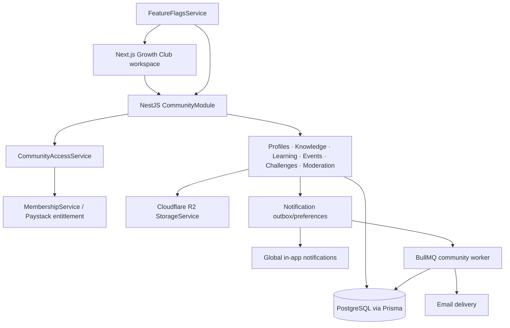
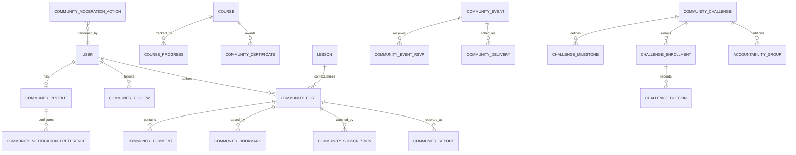
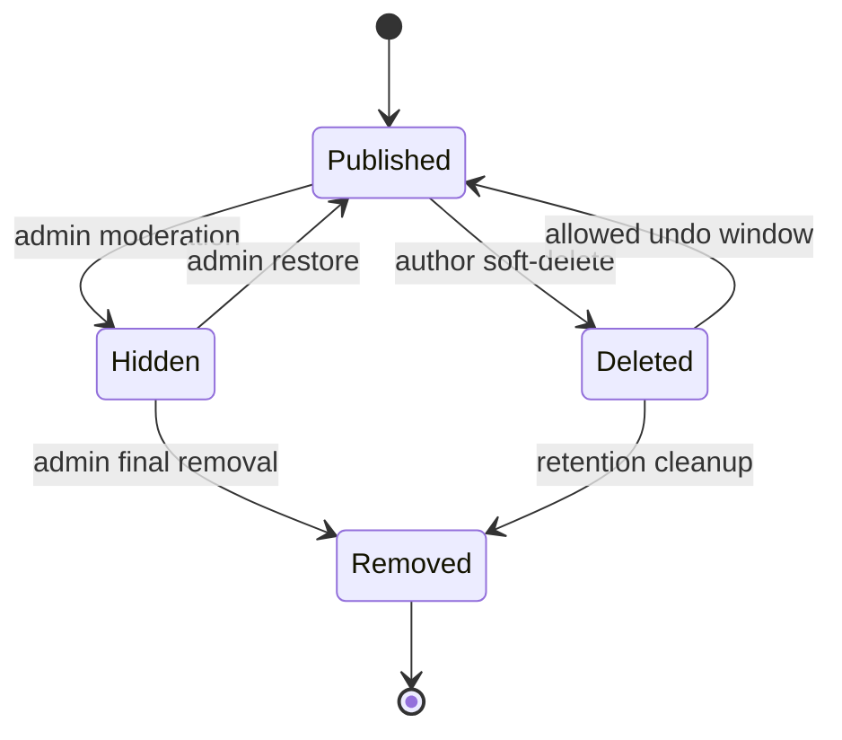
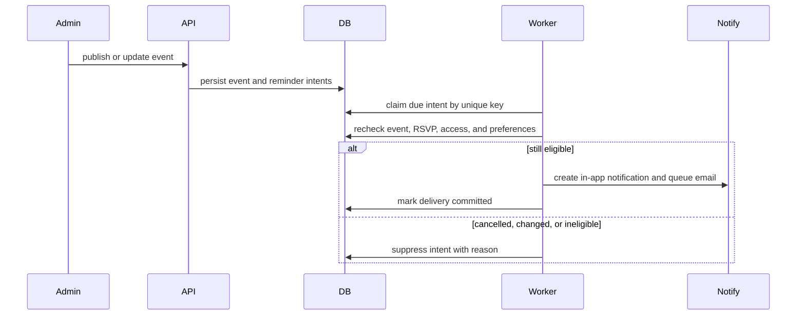

# Growth Club Platform Enhancement - Plan

## Goal Capsule

| Field | Commitment |
| --- | --- |
| Objective | Bold Ideas Growth Club becomes a professional, useful daily destination where registered CreatorPlus members can learn, ask and answer questions, attend programming, complete challenges, and build visible progress without weakening the marketplace. |
| Means | Extend the existing community module through additive domain services, a shared responsive community shell, reusable platform integrations, and phased feature-flag rollout. (KTD1, KTD10) |
| Authority | Product behavior is governed by the Requirements and Key Decisions below; implementation mechanisms are governed by the KTDs; units must cite both rather than redefine them. |
| Execution profile | Deep, cross-cutting implementation with authorization, privacy, migrations, background jobs, premium access, and multi-surface UI risk. |
| Stop conditions | Stop before launch if an access path can bypass premium checks, an additive migration cannot coexist with the currently deployed application, rich content is not sanitized server-side, or reminder jobs are not idempotent. |
| Completion owner | The implementing agent owns code, migrations, tests, deployment notes, and rollout verification through the Definition of Done. |

---

## Product Contract

### Summary

Build one coordinated Growth Club workspace that combines a professional responsive member experience, member identity and knowledge tools, richer learning, community programming, challenges, moderation, and administration while preserving free registration and item-level premium access.

### Problem Frame

Growth Club already supports free registered-member access, courses, lesson completion, discussions, attachments, notifications, points, a leaderboard, and premium courses.
The experience is currently fragmented across standalone pages, member identity is shallow, conversations have limited knowledge and moderation tools, learning is weakly connected to discussion, and there is no community-native programming or accountability system.
Adding isolated pages would deepen that fragmentation, so this work must establish a durable community product structure before layering in the new capabilities.

### Actors

- A1. **Free member** — any active registered CreatorPlus user who can participate in the community and access items marked free.
- A2. **Premium member** — an active registered user with a valid premium-course pass who can access free and premium community items.
- A3. **Growth Club administrator** — CreatorPlus owner/admin who creates programming, manages learning content, moderates members and content, and configures access.
- A4. **Community worker** — the background worker that sends digests and reminders and performs idempotent scheduled maintenance.

### Key Decisions

- **One coordinated enhancement program** (session-settled: user-directed — chosen over prioritizing only engagement, learning, or live programming: the user explicitly requested all three areas in one implementation plan). Governs R1-R23.
- **Free community with configurable premium items** — registration remains sufficient for community participation; admins may mark courses, events, challenges, and resources premium. Governs R8, R13, R16, R19.
- **CreatorPlus-owned community only** — marketplace creators do not receive independent communities or community-administration rights. Governs R21.
- **No private messaging or real-time chat in this program** — interaction remains in moderated community surfaces to limit abuse, privacy, and operational risk. Governs R6, R11, R20.

### Requirements

**Workspace and member experience**

- R1. Signed-in Growth Club pages must share a responsive community workspace with persistent desktop navigation, compact mobile navigation, consistent page hierarchy, and reusable loading, empty, locked, error, and success states.
- R2. The member home must prioritize the next useful action: resume learning, respond to followed conversations, view upcoming programming, continue challenges, and discover relevant community activity.
- R3. The redesign must preserve CreatorPlus forest, cream, gold, clay, ink, and typography tokens while replacing repetitive page-specific cards and emoji-led navigation with a coherent component and icon system.
- R4. Interactive community surfaces must be keyboard accessible, expose visible focus, respect reduced motion, and render without horizontal overflow at 320, 375, 414, 768, and desktop widths.

**Member identity and relationships**

- R5. Members must be able to maintain a community profile containing a headline, bio, expertise, goals, links, and privacy controls without exposing private account fields by default.
- R6. Members must be able to browse and search the visible member directory, follow or unfollow members, and view public contribution, progress, and achievement summaries; this must not introduce direct messages.
- R7. Following, saving, subscribing, and notification preferences must be explicit, reversible, idempotent, and protected from self-follow or duplicate rows.

**Knowledge and discussion**

- R8. Members must be able to create rich posts and replies with allow-listed formatting, R2-hosted attachments, mentions, channels, and optional course, lesson, event, or challenge context, subject to the target item's access level.
- R9. Members must be able to like, save, follow, filter, search, and paginate discussions; post authors or admins may accept one eligible answer.
- R10. Comments must support one visible reply level; deeper replies must flatten into that level rather than creating unbounded nesting.
- R11. Members must be able to report posts, comments, and profiles; administrators must be able to review reports, hide or restore content, suspend community participation, and retain an audit trail.
- R12. Deleted or moderated content must not leave broken accepted-answer references, inaccessible notification targets, unreconciled points, or public attachments that the platform still presents as active.

**Learning and credentials**

- R13. Course discovery and the player must support continue-learning state, module progress, lesson duration, video, rich text, R2 resources, drip rules, and clear free/premium presentation.
- R14. Lessons may have structured discussions that inherit course access and appear in both the lesson experience and the wider knowledge feed without duplicating content.
- R15. A configured course may issue one verifiable certificate to an eligible member after server-confirmed completion; administrators may revoke a certificate without deleting progress.

**Programming and accountability**

- R16. Administrators must be able to schedule free or premium Growth Club events and office hours with UTC timestamps, an IANA display timezone, RSVP limits, attendance status, protected join links, replay/resources, and cancellation.
- R17. Eligible RSVP members must receive configurable, deduplicated in-app and email reminders and must not receive reminders after cancellation or access loss.
- R18. Administrators must be able to create finite challenges with milestones, check-in rules, dates, capacity, resources, and optional accountability groups.
- R19. Eligible members must be able to join or leave a challenge, submit idempotent check-ins, view their progress, and participate in a moderated challenge/group activity surface.

**Platform ownership, access, and operations**

- R20. All new reads and mutations must enforce active-account, item visibility, free/premium entitlement, ownership, and administrator rules on the server; hiding a control in the UI is never sufficient authorization.
- R21. Only CreatorPlus administrators may create courses, events, challenges, channels, moderation policies, and official announcements.
- R22. Community-generated and administrator-uploaded assets must continue to use the existing Cloudflare R2 storage service and server validation; arbitrary external file URLs and base64 image persistence are not allowed.
- R23. The upgrade must preserve existing users, posts, comments, points, courses, lesson progress, premium subscriptions, public routes, and marketplace behavior through additive migrations, backward-compatible API evolution, feature flags, and observable staged rollout.

### Key Flows

- F1. **Daily member return**
  - **Trigger:** A1 or A2 enters Growth Club.
  - **Steps:** Access is validated; the home endpoint returns bounded next actions; the member resumes a course, conversation, event, or challenge.
  - **Outcome:** The member reaches useful work without scanning unrelated dashboards.
  - **Covered by:** R1-R4, R13, R16, R18, R20.
- F2. **Question to reusable answer**
  - **Trigger:** A1 or A2 publishes a question.
  - **Steps:** Content and attachments are validated; mentions/subscriptions are recorded; members reply; an eligible answer is accepted; search and filters expose the resolved thread.
  - **Outcome:** The conversation remains searchable knowledge rather than a transient feed item.
  - **Covered by:** R8-R12, R20, R22.
- F3. **Course continuation and completion**
  - **Trigger:** A member opens a course or uses Resume learning.
  - **Steps:** Entitlement and drip state are checked; last activity is restored; the member consumes content, joins lesson discussion, completes lessons, and becomes certificate-eligible when configured.
  - **Outcome:** Progress and credentials reflect server-confirmed learning state.
  - **Covered by:** R13-R15, R20, R22.
- F4. **Event lifecycle**
  - **Trigger:** A3 publishes an event or office hour.
  - **Steps:** Eligible members discover and RSVP; reminders are claimed once; protected join information becomes available in-window; cancellation suppresses future delivery; replay/resources appear afterward.
  - **Outcome:** Programming is safely operated inside Growth Club without marketplace checkout or tickets.
  - **Covered by:** R16, R17, R20-R23.
- F5. **Challenge participation**
  - **Trigger:** A member joins an eligible challenge.
  - **Steps:** Capacity and entitlement are validated; an accountability group is assigned when configured; check-ins advance milestones; activity remains moderated; completion awards are recorded once.
  - **Outcome:** Members receive structured accountability without private chat.
  - **Covered by:** R18-R23.
- F6. **Moderation response**
  - **Trigger:** A member submits a report or A3 identifies harmful content.
  - **Steps:** The report is deduplicated; A3 reviews context; content or community participation is restricted; points, accepted answers, search visibility, and notifications reconcile; an audit action is retained.
  - **Outcome:** Harmful content is contained without destroying evidence or unrelated account data.
  - **Covered by:** R11, R12, R20, R21, R23.

### Acceptance Examples

- AE1. **Free member and premium course:** Given A1 opens a premium course or linked lesson discussion, the API denies protected content while still allowing free community participation. Covers R13, R14, R20.
- AE2. **Premium expiry:** Given A2 loses entitlement after a Paystack subscription expires, subsequent premium course, event, challenge, replay, and resource requests are denied without deleting existing progress. Covers R16-R20, R23.
- AE3. **Existing content after migration:** Given an existing post, comment, course, or lesson-progress row, the upgraded application renders it with compatible defaults and no manual edit. Covers R23.
- AE4. **Accepted answer moderation:** Given an accepted reply is hidden or deleted, the thread remains available and the accepted-answer marker is cleared transactionally. Covers R9, R11, R12.
- AE5. **Mention deduplication:** Given one post mentions the same member more than once, the member receives at most one notification for that post and never receives a self-mention notification. Covers R7-R9.
- AE6. **Cancelled event:** Given an event is cancelled after members RSVP, the join link is no longer returned and pending reminders are suppressed; attendees receive one cancellation notification. Covers R16, R17.
- AE7. **Reminder retry:** Given a worker retries the same due reminder, only one notification/email delivery record is committed. Covers R17, R23.
- AE8. **Challenge check-in retry:** Given a client retries the same milestone check-in, progress and points advance once. Covers R18, R19.
- AE9. **Unsafe rich content:** Given a post contains script, event-handler, data URL, arbitrary iframe, or external file URL content, the server rejects or removes it before storage and rendering. Covers R8, R22.
- AE10. **Responsive workspace:** Given any core member route at the required widths, primary navigation, content, forms, and action controls remain usable without horizontal scrolling or two-line primary actions. Covers R1-R4.
- AE11. **Community suspension:** Given A3 suspends a member from Growth Club, new community reads and writes are blocked while marketplace account data remains unchanged. Covers R11, R20, R21.
- AE12. **Certificate idempotency:** Given a completed eligible course is rechecked, the same active certificate is returned rather than issuing a duplicate. Covers R15.

### Success Criteria

- Existing community records and premium subscriptions remain usable after production migration without destructive backfill.
- Every protected capability passes the anonymous/free/premium/admin/suspended authorization matrix at API level.
- Core member journeys pass automated browser coverage at required mobile, tablet, and desktop widths, including keyboard and reduced-motion checks.
- Reminder, check-in, follow, save, subscription, points, RSVP, and certificate operations are idempotent under retries.
- Administrators can operate courses, discussions, events, challenges, reports, and access levels without database or deployment intervention.
- Feature flags allow each delivery phase to be enabled for internal/admin users, a percentage cohort, and then all members without reverting migrations.
- Before member-cohort rollout, baseline and instrument weekly returning community members, resume-learning completion, questions receiving accepted answers, RSVP-to-attendance, and challenge completion; each capability must have an agreed adoption target and must not materially regress the existing community activation baseline before broad release.

### Scope Boundaries

**Included**

- CreatorPlus-owned Growth Club for registered members.
- Professional member workspace, profiles, knowledge tools, learning, certificates, events, office hours, challenges, accountability groups, moderation, notifications, administration, and rollout controls.
- Existing Paystack/Stripe premium pass as the entitlement source, with Paystack remaining the primary Nigerian payment flow.
- Existing Cloudflare R2 storage for all community files and images.

**Deferred to Follow-Up Work**

- Dedicated Meilisearch indexing if measured PostgreSQL search latency or relevance becomes inadequate.
- Native mobile applications and push notifications.
- Automated content moderation or AI-generated summaries after manual moderation telemetry exists.
- Public certificate sharing pages beyond a minimal verification route.

**Outside This Product's Identity**

- Marketplace creators operating independent communities.
- Member-to-member private messaging, private group chat, or real-time public chat.
- Marketplace ticket checkout for Growth Club office hours or events.
- Unmoderated member-created events, challenges, or accountability groups.

### Dependencies

- Existing JWT and role guards, `MembershipService`, feature flags, `NotificationsService`, `EmailService`, R2 `StorageService`, Prisma/PostgreSQL, Redis/BullMQ workers, and CreatorPlus design tokens.
- Production environments must have stable R2 configuration; reminder/digest reliability requires the worker and Redis to be deployed and monitored.
- The deployment process must run Prisma migrations before enabling feature flags and must support overlapping old/new application versions.

### Sources and Research

- `apps/api/src/community/` — current course, feed, points, authorization, notification, and attachment behavior.
- `apps/web/src/app/(marketplace)/community/` — current landing, dashboard, discussion, thread, course player, join, and admin experiences.
- `packages/database/prisma/schema.prisma` — current community, membership, notification, marketplace event, user-profile, and feature-flag models.
- `apps/workers/src/jobs/community-digest.ts` — existing digest is incorrectly restricted to paid subscribers despite free community access and must be reconciled during U1.
- `apps/workers/src/jobs/events.ts` — repeatable sweep pattern is reusable, but window-only reminder deduplication is insufficient for editable Growth Club programming.
- `apps/web/src/styles/globals.css` and `apps/web/src/components/layout/header.tsx` — existing CreatorPlus design tokens and global marketplace shell.
- `apps/web/src/components/market/rich-text-editor.tsx` and `apps/web/src/lib/rich-text.ts` — reusable rich-text concepts plus current base64-image and client-only sanitation limitations.

---

## Planning Contract

### Key Technical Decisions

- KTD1. **Extend the existing CommunityModule through focused domain services.** Keep one `/community` API and route family, but separate access, home, profiles, knowledge, learning, programming, challenges, moderation, and notification concerns so the current feed and course services do not become monoliths.
- KTD2. **Centralize community authorization in a CommunityAccessService.** The service resolves active account state, administrator bypass, visibility, and free/premium entitlement and is invoked by every protected service read and mutation. It normalizes existing `CourseAccessLevel` and a new generic community access level without renaming the deployed course enum in the first migration.
- KTD3. **Use domain-owned additive migrations and lazy/default backfill.** U1 adds only cross-domain foundations; U3-U7 each own their feature tables, indexes, and compatibility defaults. Existing rows receive safe defaults, old columns and routes remain until rollout is complete, and nullable relationships allow old application versions to coexist with the new schema.
- KTD4. **Create community-native programming models.** Do not reuse marketplace `Event` and `Ticket`, which require Product, Order, payment holds, and ticket check-in. Reuse only proven UTC/IANA-timezone and calendar-link behavior.
- KTD5. **Persist due work before delivery.** Community reminder/digest jobs use durable records with unique idempotency keys and worker claims; editing, cancellation, preference changes, or access loss are rechecked immediately before delivery.
- KTD6. **Start knowledge discovery in PostgreSQL.** Use indexed filters, stable cursor pagination, and bounded text search first; add Meilisearch only after measured need.
- KTD7. **Store rich content with an explicit format and sanitize on the server.** Existing Markdown remains renderable; new rich HTML uses a strict shared allow-list; images/files must be uploaded into server-approved community R2 namespaces, recorded against an owning resource, and embeds remain host allow-listed.
- KTD8. **Build a nested community shell from existing CreatorPlus tokens.** Hallmark guidance shapes the design: preserve brand typography and palette, establish structural hierarchy and full interaction states, avoid repeated generic card grids, keep motion restrained, and verify the required widths.
- KTD9. **Introduce typed, cursor-based community contracts.** Replace new `any`-based integrations with shared response/request types and consistent pagination metadata; retain compatibility adapters for current routes until their consumers migrate.
- KTD10. **Ship by capability flags over backward-compatible schema.** Gate the new shell, knowledge tools, learning upgrades, programming, and challenges independently; enforce flags on the API as well as the web client.
- KTD11. **Add browser journey coverage with Playwright.** API unit/integration tests remain authoritative for permissions and state; Playwright covers navigation, responsive behavior, accessibility-critical interaction, and cross-page member journeys missing from the current repository.

### High-Level Technical Design

**Component topology**

**Domain data ownership**

**Content and moderation lifecycle**

**Scheduled community delivery**

### System-Wide Impact

- **Authentication and authorization:** Community access must additionally reject suspended/deactivated accounts because the current JWT strategy validates token shape but does not reload user status.
- **Data lifecycle:** New soft states and audit rows increase retention obligations; hard deletion must be a deliberate privacy/operations path, not the normal moderation action.
- **Payments:** No new checkout product is introduced. Existing provider-neutral membership state remains the premium entitlement source, so Paystack webhook behavior is unchanged but receives broader access-control coverage.
- **Storage:** Community editors must stop persisting base64 images and must use server-approved Cloudflare R2 namespaces, ownership records, and URL validation consistently.
- **Notifications and workers:** Global in-app notifications remain the presentation layer; community preferences, outbox/idempotency, reminders, and corrected free-member digest targeting become community responsibilities.
- **Performance:** Personalized home, directory, feed, and programming queries must be bounded, indexed, and cursor-paginated; aggregate counts must avoid per-row queries.
- **Operations:** New feature flags, worker health, reminder lag, failed deliveries, report backlog, and entitlement denials require observable admin/operational signals.

### Phased Delivery

1. **Foundation:** U1 establishes additive schema, typed contracts, authorization, browser harness, and corrected free-community digest eligibility.
2. **Professional workspace:** U2 and U3 ship the new shell, home, profiles, directory, follows, and preferences behind the shell/profile flags.
3. **Knowledge and learning:** U4 and U5 add rich discussions, moderation, linked lesson knowledge, improved progress, and certificates.
4. **Programming and accountability:** U6 and U7 add community events, office hours, reminders, challenges, and accountability groups.
5. **Operations and rollout:** U8 completes administration, telemetry, staged rollout, compatibility verification, and release gates.

### Risks and Mitigations

| Risk | Impact | Mitigation |
| --- | --- | --- |
| Authorization drift across linked resources | Premium or hidden content can leak | KTD2 central access service; authorization matrix in every domain unit; API-side flag checks. |
| Migration/application overlap | Deployment outage or old app failures | Additive nullable/default columns; no destructive rename/drop; flags remain off until migration and smoke verification. |
| Rich-content XSS or storage abuse | Account compromise or malicious content | KTD7 server sanitation, R2-only media, allow-listed embeds, size/type limits, CSP review, adversarial tests. |
| Notification/reminder duplication | Member distrust and email spam | KTD5 unique delivery keys, transactional claims, eligibility recheck, retry tests, preference enforcement. |
| Gamification rewards spam | Low-quality community behavior | Idempotent quality-linked awards, moderation revocation, daily/action caps where needed, no points for repetitive check-ins beyond rules. |
| Expanded UI overwhelms members | Lower engagement despite more features | KTD8 task-oriented home, progressive disclosure, persistent navigation, restrained visual density, usability/browser checks. |
| Search degrades as content grows | Slow or irrelevant discovery | KTD6 indexed bounded queries, query metrics, and explicit Meilisearch escalation trigger. |
| Worker is unavailable | Missing reminders/digests | Persist intents, expose lag/failure telemetry, retry after recovery, never send future reminders inline as a fallback. |

### Deferred Implementation Notes

- Exact service/helper names may adjust during implementation while domain ownership and route compatibility remain as specified.
- The final rich-text sanitizer package may be selected during U1 after confirming Node 20/Nest compatibility; the allow-list and server-side enforcement are not optional.
- Search ranking weights and member-home recommendation ordering should start deterministic and be tuned from production telemetry rather than invented during implementation.

---

## Implementation Units

### U1. Establish community platform foundations

- **Goal:** Add backward-compatible data contracts, centralized access enforcement, durable capability flags, browser-test scaffolding, and corrected free-member digest eligibility.
- **Requirements:** R20-R23; establishes the shared notification/idempotency foundations later used to satisfy R7 and supports every later requirement.
- **Dependencies:** None.
- **Files:**
  - `packages/database/prisma/schema.prisma`
  - `packages/database/prisma/migrations/<timestamp>_community_platform_foundation/migration.sql`
  - `packages/database/generated/prisma/`
  - `apps/api/src/community/community-access.service.ts`
  - `apps/api/src/community/community-access.service.spec.ts`
  - `apps/api/src/community/dto/community-shared.dto.ts`
  - `apps/api/src/community/community.module.ts`
  - `apps/api/src/community/community-courses.service.ts`
  - `apps/api/src/community/community-courses.service.spec.ts`
  - `apps/workers/src/jobs/community-digest.ts`
  - `apps/workers/src/jobs/community-digest.spec.ts`
  - `apps/workers/jest.config.js`
  - `apps/workers/package.json`
  - `apps/web/src/lib/community-types.ts`
  - `apps/web/package.json`
  - `package-lock.json`
  - `apps/web/playwright.config.ts`
  - `apps/web/e2e/community-access.spec.ts`
- **Approach:**
  1. Add only cross-domain foundations: community participation status, notification preferences/delivery idempotency, generic access vocabulary for new resources, and server-side feature-evaluation support. Feature-specific tables remain owned by U3-U7 per KTD3.
  2. Introduce KTD2 as the only entitlement/status decision point and migrate current course checks to it before new domains consume it.
  3. Add typed access and pagination contracts that current routes can adopt without changing their existing response shape prematurely.
  4. Add server-consumed flags for each delivery phase and seed them disabled; do not rely on the public flag list for authorization.
  5. Correct the digest recipient rule from active paid subscribers to eligible active registered members with preferences, while retaining the existing no-empty-digest behavior.
  6. Add explicit worker-test and Playwright scripts/configuration, plus authenticated browser fixtures that never embed production credentials.
- **Execution note:** Start with access-policy and migration compatibility tests before migrating existing services.
- **Patterns to follow:** `CommunityCoursesService`, `MembershipService.hasActiveMembership`, `FeatureFlagsService.isEnabled`, `CommunityPointEvent` uniqueness, and existing Prisma migration conventions.
- **Test scenarios:**
  - A free active user passes general community access and fails a premium item check.
  - An active premium user passes premium access; an expired or cancelled subscription fails without deleting progress.
  - An admin passes item access while still respecting account-active checks.
  - Suspended and deactivated users are denied community access even with a valid JWT or subscription.
  - Existing courses/posts/comments/progress migrate with defaults and remain readable by the old-compatible query paths.
  - Duplicate notification-delivery claims are prevented by database constraints and retrying a claimed digest delivery does not enqueue it twice.
  - A daily digest includes eligible free members, excludes inactive/suspended/opted-out users, and queues nothing when there is no activity.
  - Feature-disabled API routes reject or return the established unavailable response even when the web UI is bypassed.
  - Environment-scoped and percentage flags evaluate deterministically for the authenticated user and never treat an anonymous/public flag response as authorization.
- **Verification:** Prisma validates and generates; foundation migration applies to a production-shaped snapshot; existing community tests remain green; access browser smoke covers free, premium, and denied states.

### U2. Build the professional community shell and member home

- **Goal:** Replace page-by-page community framing with the shared responsive workspace and task-oriented home described by R1-R4.
- **Requirements:** R1-R4, R23; F1; AE10.
- **Dependencies:** U1.
- **Files:**
  - `apps/web/src/app/(marketplace)/community/layout.tsx`
  - `apps/web/src/app/(marketplace)/community/page.tsx`
  - `apps/web/src/components/community/community-shell.tsx`
  - `apps/web/src/components/community/community-navigation.tsx`
  - `apps/web/src/components/community/community-page-state.tsx`
  - `apps/web/src/components/community/community-icons.tsx`
  - `apps/web/src/components/community/member-avatar.tsx`
  - `apps/web/src/styles/globals.css`
  - `apps/web/src/lib/api.ts`
  - `apps/api/src/community/community-home.controller.ts`
  - `apps/api/src/community/community-home.service.ts`
  - `apps/api/src/community/community-home.service.spec.ts`
  - `apps/web/e2e/community-shell.spec.ts`
- **Approach:**
  1. Create a nested signed-in shell with desktop rail/top context and compact mobile navigation while leaving the signed-out marketing invitation intact.
  2. Add one bounded home aggregate that returns next lesson, followed-thread activity, upcoming RSVP, active challenge, level, and a small discovery section without N+1 queries.
  3. Apply KTD8 using the existing token system: stronger typography and whitespace hierarchy, fewer interchangeable cards, consistent controls, full interaction states, restrained transform/opacity motion, and reduced-motion support.
  4. Ensure deep links to discussion, posts, lessons, events, challenges, and notifications retain location context inside the shell.
- **Patterns to follow:** Marketplace `Header` accessibility behavior, global focus/reduced-motion rules, CreatorPlus brand tokens, and the existing member-avatar component.
- **Test scenarios:**
  - Signed-out `/community` still shows the public invitation and registration/sign-in paths without rendering private navigation.
  - A member with no activity sees useful onboarding and empty states rather than blank panels.
  - A member with learning, followed-thread, RSVP, and challenge state receives bounded next actions in deterministic priority order.
  - A failed home subsection does not hide successfully loaded next actions; retry restores only the failed section.
  - Keyboard users can reach and operate navigation, menus, filters, and primary actions with visible focus.
  - Covers AE10 at 320, 375, 414, 768, and desktop widths with no horizontal overflow and reduced-motion behavior.
- **Verification:** The shell is shared by all signed-in community routes, retains global marketplace header/footer compatibility, and passes visual/browser checks without altering non-community pages.

### U3. Add member profiles, directory, follows, saves, and preferences

- **Goal:** Give members useful, privacy-controlled identity and reversible relationship tools.
- **Requirements:** R5-R7, R20-R23; supports F1 and F2.
- **Dependencies:** U1, U2.
- **Files:**
  - `apps/api/src/community/community-profiles.controller.ts`
  - `apps/api/src/community/community-profiles.service.ts`
  - `apps/api/src/community/community-profiles.service.spec.ts`
  - `apps/api/src/community/dto/community-profile.dto.ts`
  - `apps/api/src/community/community-notifications.service.ts`
  - `apps/api/src/community/community-notifications.service.spec.ts`
  - `packages/database/prisma/schema.prisma`
  - `packages/database/prisma/migrations/<timestamp>_community_profiles_relationships/migration.sql`
  - `packages/database/generated/prisma/`
  - `apps/web/src/app/(marketplace)/community/members/page.tsx`
  - `apps/web/src/app/(marketplace)/community/member/[id]/page.tsx`
  - `apps/web/src/app/(marketplace)/community/settings/page.tsx`
  - `apps/web/src/components/community/member-profile-card.tsx`
  - `apps/web/src/lib/api.ts`
  - `apps/web/e2e/community-members.spec.ts`
- **Approach:**
  1. Extend the existing community profile rather than duplicating account or marketplace creator profiles; expose only explicitly public community fields.
  2. Add stable cursor pagination and bounded search/filtering for the visible directory.
  3. Implement follows, saved content, post subscriptions, and notification preferences with unique constraints and idempotent toggles per R7.
  4. Record activity summaries from authoritative community rows; do not expose private course content, email, account status, or subscription details on public profiles.
- **Patterns to follow:** Existing `UserProfile` privacy boundary, `CommunityPostLike` idempotent relation, notification metadata routing, and cursor/pagination helpers.
- **Test scenarios:**
  - A new member has conservative defaults: display name/avatar visible, optional biography/location/social fields hidden until published.
  - A member cannot follow themselves and duplicate follow requests remain one row.
  - Hidden profiles do not appear in directory search and return only the allowed private-self/admin view.
  - Saved content and subscriptions are visible only to their owner and survive repeated toggle requests without duplicates.
  - Notification preference changes affect future deliveries without deleting in-app history.
  - Suspended/deactivated members disappear from directory results and cannot be followed.
- **Verification:** Directory/profile/settings routes honor privacy and access rules at API and browser levels; all relationship operations are reversible and idempotent.

### U4. Upgrade discussions into a moderated knowledge system

- **Goal:** Add rich composition, structured context, one-level replies, accepted answers, mentions, saves/subscriptions, search, and moderation without losing current content.
- **Requirements:** R8-R12, R20-R23; F2, F6; AE4, AE5, AE9, AE11.
- **Dependencies:** U1-U3.
- **Files:**
  - `apps/api/src/community/community-feed.controller.ts`
  - `apps/api/src/community/community-feed.service.ts`
  - `apps/api/src/community/community-feed.service.spec.ts`
  - `apps/api/src/community/community-moderation.controller.ts`
  - `apps/api/src/community/community-moderation.service.ts`
  - `apps/api/src/community/community-moderation.service.spec.ts`
  - `apps/api/src/community/community-rich-content.ts`
  - `apps/api/src/community/community-rich-content.spec.ts`
  - `apps/api/src/community/dto/feed.dto.ts`
  - `packages/database/prisma/schema.prisma`
  - `packages/database/prisma/migrations/<timestamp>_community_knowledge_moderation/migration.sql`
  - `packages/database/generated/prisma/`
  - `apps/web/src/app/(marketplace)/community/discussion/page.tsx`
  - `apps/web/src/app/(marketplace)/community/post/[id]/page.tsx`
  - `apps/web/src/app/(marketplace)/community/saved/page.tsx`
  - `apps/web/src/components/community/community-rich-editor.tsx`
  - `apps/web/src/components/community/post-card.tsx`
  - `apps/web/src/components/community/thread-reply.tsx`
  - `apps/web/src/components/community/report-dialog.tsx`
  - `apps/web/src/components/community/rich-content.tsx`
  - `apps/web/src/lib/api.ts`
  - `apps/web/e2e/community-discussion.spec.ts`
- **Approach:**
  1. Preserve existing Markdown through an explicit content format while new rich posts use KTD7 and R2 uploads.
  2. Move feed queries to cursor pagination and return accepted, followed, saved, mention, context, and moderation state required by the UI.
  3. Enforce one visible reply level, accepted-answer ownership, contextual access, and transactional cleanup per R8-R12.
  4. Add member reporting and soft moderation with auditable actions; normal moderation hides content rather than hard-deleting evidence.
  5. Reconcile points when content is removed/restored; prevent moderated content from search, home activity, digests, and profile summaries; and retract or safely tombstone notification targets that are no longer readable.
  6. Store channel definitions and official-announcement state in the knowledge domain, while reserving channel and announcement creation for CreatorPlus administrators.
- **Execution note:** Add adversarial sanitation and authorization tests before enabling the rich editor or contextual links.
- **Patterns to follow:** Current post/comment ownership checks, `assertOwnStorageUrl`, points award/revoke ledger, notifications, and existing rich-text rendering safety concepts.
- **Test scenarios:**
  - Existing Markdown posts render unchanged after the format migration.
  - A rich post with safe formatting and R2 attachment persists and renders; unsafe tags, handlers, protocols, iframe hosts, base64 images, and external file URLs are removed or rejected.
  - A free member cannot read or reply to a discussion linked to a premium lesson, event, or challenge.
  - One-level replies serialize predictably; a reply-to-reply flattens beneath the top-level parent.
  - Covers AE4: hiding/deleting an accepted answer clears the reference atomically and preserves the thread.
  - Covers AE5: repeated/self mentions produce zero duplicate/self notifications.
  - Reports are deduplicated per reporter/target/reason window; non-admin users cannot inspect the moderation queue.
  - Covers AE11: community suspension blocks community access without mutating marketplace roles, orders, or creator data.
  - Cursor pagination does not duplicate or omit posts when activity changes between pages.
- **Verification:** Discussion, thread, saved, search, report, and moderation flows pass API and browser tests; sanitized content is the only rendered raw HTML path.

### U5. Connect learning, lesson discussion, progress, and certificates

- **Goal:** Turn the current course player into a continuous learning experience connected to community knowledge and verifiable completion.
- **Requirements:** R13-R15, R20-R23; F3; AE1-AE3, AE12.
- **Dependencies:** U1, U2, U4.
- **Files:**
  - `apps/api/src/community/community-courses.service.ts`
  - `apps/api/src/community/community-courses.service.spec.ts`
  - `apps/api/src/community/community-certificates.controller.ts`
  - `apps/api/src/community/community-certificates.service.ts`
  - `apps/api/src/community/community-certificates.service.spec.ts`
  - `apps/api/src/community/dto/course.dto.ts`
  - `packages/database/prisma/schema.prisma`
  - `packages/database/prisma/migrations/<timestamp>_community_learning_certificates/migration.sql`
  - `packages/database/generated/prisma/`
  - `apps/web/src/app/(marketplace)/community/course/[slug]/page.tsx`
  - `apps/web/src/app/(marketplace)/community/certificates/[code]/page.tsx`
  - `apps/web/src/components/community/course-navigation.tsx`
  - `apps/web/src/components/community/course-progress.tsx`
  - `apps/web/src/components/community/lesson-discussion.tsx`
  - `apps/web/src/lib/api.ts`
  - `apps/web/e2e/community-learning.spec.ts`
- **Approach:**
  1. Add per-course last-activity state while preserving existing binary lesson progress rows and completion semantics.
  2. Expose resume-learning data through the home contract and update it only after a server-authorized lesson view or completion action.
  3. Represent lesson discussion as contextual community posts so one source appears in the lesson and wider feed under the same entitlement.
  4. Issue certificates from server-calculated course completion, store a unique verification code and immutable display snapshot, and support admin revocation.
  5. Keep Bunny Stream and existing allow-listed video behavior; all downloadable resources remain R2 validated.
- **Patterns to follow:** Current drip calculation, premium-course checks, lesson completion point idempotency, Bunny embed validation, and existing course/module/lesson authoring.
- **Test scenarios:**
  - A member resumes the latest authorized incomplete lesson; locked or premium-ineligible lessons are never selected.
  - Marking a lesson complete/incomplete updates course summaries, home next action, and points exactly once.
  - Covers AE1: a free member cannot access premium lesson content or its discussion through direct API calls.
  - Drip-locked lessons do not expose body, video, files, discussion content, or certificate progress prematurely.
  - Existing completion rows produce the same completed count after new progress state is introduced.
  - Covers AE12: repeated completion checks return the same active certificate; revocation blocks verification without deleting progress.
  - A course with certificates disabled never issues one even at 100% completion.
- **Verification:** Course grid, resume flow, player, linked discussion, completion, premium/drip locks, and certificate verification pass API and browser coverage.

### U6. Add community events, office hours, RSVP, reminders, and replays

- **Goal:** Operate Growth Club programming independently from marketplace product tickets while reusing proven scheduling infrastructure.
- **Requirements:** R16, R17, R20-R23; F4; AE2, AE6, AE7.
- **Dependencies:** U1-U4.
- **Files:**
  - `apps/api/src/community/community-events.controller.ts`
  - `apps/api/src/community/community-events.service.ts`
  - `apps/api/src/community/community-events.service.spec.ts`
  - `apps/api/src/community/dto/community-event.dto.ts`
  - `packages/database/prisma/schema.prisma`
  - `packages/database/prisma/migrations/<timestamp>_community_programming/migration.sql`
  - `packages/database/generated/prisma/`
  - `apps/workers/src/jobs/community-programming.ts`
  - `apps/workers/src/jobs/community-programming.spec.ts`
  - `apps/workers/src/queues/index.ts`
  - `apps/workers/src/index.ts`
  - `apps/web/src/app/(marketplace)/community/events/page.tsx`
  - `apps/web/src/app/(marketplace)/community/events/[slug]/page.tsx`
  - `apps/web/src/components/community/event-card.tsx`
  - `apps/web/src/components/community/event-calendar-link.tsx`
  - `apps/web/src/lib/api.ts`
  - `apps/web/e2e/community-events.spec.ts`
- **Approach:**
  1. Implement KTD4 models and lifecycle with draft, published, live/completed-by-time, and cancelled behavior while storing UTC plus IANA timezone.
  2. Enforce access and capacity transactionally during RSVP; returning members receive their existing RSVP rather than duplicate rows.
  3. Return protected join/replay/resource URLs only after access, RSVP, status, and configured time-window checks.
  4. Implement KTD5 reminder intents and worker claims; event edits reschedule pending intents and cancellation suppresses them before sending one cancellation notice.
  5. Add calendar downloads from event metadata without exposing protected join URLs in public calendar payloads.
  6. Treat join links as secrets: omit them from logs, analytics, notification payloads, and shared caches; return them from non-cacheable authorized responses only. Support auditable admin attendance updates after the event.
- **Patterns to follow:** Marketplace event UTC/timezone formatting and calendar helpers, worker repeat scheduling, email rendering, notification metadata, and KTD2 access checks.
- **Test scenarios:**
  - Free and premium events enforce their configured access for listing detail, RSVP, join, replay, and resource reads.
  - Capacity is not oversold under concurrent RSVP requests; duplicate requests return the existing active RSVP.
  - Join URLs remain absent before the allowed window and after cancellation or access loss.
  - Covers AE6: cancellation suppresses pending reminders and sends one cancellation notification.
  - Covers AE7: repeated worker claims/retries commit one delivery per member/event/reminder type.
  - Updating time or timezone replaces pending reminder schedule without duplicating sent records.
  - A worker outage leaves due intents pending and delivers them only if still relevant after recovery.
  - Admin attendance changes are authorized and audited; members cannot mark themselves or others attended.
- **Verification:** Admin create/publish/update/cancel, member discovery/RSVP/join/replay, timezone/calendar, and worker reminder flows pass integration and browser tests.

### U7. Add challenges, milestones, accountability groups, and check-ins

- **Goal:** Provide structured, moderated accountability with measurable progress and no private messaging dependency.
- **Requirements:** R18-R23; F5; AE2, AE8.
- **Dependencies:** U1-U4.
- **Files:**
  - `apps/api/src/community/community-challenges.controller.ts`
  - `apps/api/src/community/community-challenges.service.ts`
  - `apps/api/src/community/community-challenges.service.spec.ts`
  - `apps/api/src/community/dto/community-challenge.dto.ts`
  - `packages/database/prisma/schema.prisma`
  - `packages/database/prisma/migrations/<timestamp>_community_challenges/migration.sql`
  - `packages/database/generated/prisma/`
  - `apps/api/src/community/community-points.service.ts`
  - `apps/api/src/community/community-points.service.spec.ts`
  - `apps/web/src/app/(marketplace)/community/challenges/page.tsx`
  - `apps/web/src/app/(marketplace)/community/challenges/[slug]/page.tsx`
  - `apps/web/src/components/community/challenge-progress.tsx`
  - `apps/web/src/components/community/challenge-check-in.tsx`
  - `apps/web/src/components/community/accountability-group.tsx`
  - `apps/web/src/lib/api.ts`
  - `apps/web/e2e/community-challenges.spec.ts`
- **Approach:**
  1. Model finite challenge windows, ordered milestones, eligibility/capacity, enrollment, idempotent check-ins, optional group assignment, R2-validated resources, and completion.
  2. Reuse contextual community posts for challenge and group activity, enforcing membership and moderation without introducing direct/private chat.
  3. Expand the point-reason catalog with quality-linked challenge actions and unique source keys; revoke rewards when a check-in is invalidated.
  4. Expose individual progress and bounded group summaries without leaking private profile fields or premium content.
- **Patterns to follow:** Community course progress, points ledger uniqueness, feed contextual access, and admin content patterns.
- **Test scenarios:**
  - A member can join a free eligible challenge once; premium, capacity, date, suspension, and feature-flag failures are enforced server-side.
  - Group assignment remains stable across retries and never exceeds configured capacity under concurrent joins.
  - Covers AE8: duplicate check-in submission advances milestone/progress/points once.
  - A check-in outside its allowed window is rejected without partial state.
  - Leaving a challenge removes future group access but preserves an auditable participation history.
  - Hidden or invalidated check-ins disappear from group activity and revoke their points once.
  - Challenge completion occurs only after required milestones and cannot be repeated for additional rewards.
- **Verification:** Challenge creation, enrollment, group assignment, check-in, contextual activity, completion, and point reconciliation pass API and browser tests.

### U8. Complete administration, automation, observability, and staged rollout

- **Goal:** Give CreatorPlus operators one safe control surface and enough telemetry to release and operate every new capability without breaking the platform.
- **Requirements:** R11, R16-R23; F4-F6; all success criteria.
- **Dependencies:** U1-U7.
- **Files:**
  - `apps/web/src/app/(marketplace)/community/manage/page.tsx`
  - `apps/web/src/app/(marketplace)/community/manage/courses/page.tsx`
  - `apps/web/src/app/(marketplace)/community/manage/events/page.tsx`
  - `apps/web/src/app/(marketplace)/community/manage/challenges/page.tsx`
  - `apps/web/src/app/(marketplace)/community/manage/moderation/page.tsx`
  - `apps/web/src/components/community/admin/`
  - `apps/api/src/community/community-admin.controller.ts`
  - `apps/api/src/community/community-admin.service.ts`
  - `apps/api/src/community/community-admin.service.spec.ts`
  - `apps/workers/src/index.ts`
  - `apps/workers/src/jobs/community-digest.ts`
  - `apps/workers/src/jobs/community-programming.ts`
  - `apps/web/e2e/community-admin.spec.ts`
  - `apps/web/e2e/community-regression.spec.ts`
  - `docs/runbooks/growth-club-rollout.md`
- **Approach:**
  1. Refactor the existing course manager into focused admin routes inside one management shell; keep current course URLs redirect-compatible.
  2. Add course/event/challenge authoring, channel and official-announcement management, access selection, schedule/replay configuration, report queue, moderation history, certificate revocation, and community suspension controls.
  3. Add operational summaries for report backlog, reminder lag/failure, digest delivery, RSVP/check-in counts, entitlement denials, feature-flag cohort behavior, and the product-success measures defined above without exposing private member content in logs.
  4. Roll out U2-U7 capability flags in order: administrators/internal cohort, small deterministic member cohort, expanded cohort, then all members; retain old compatible routes until final verification.
  5. Document migration ordering, worker deployment, flag sequence, rollback by flag, data retention, and post-deploy smoke checks.
- **Execution note:** Treat this as release hardening; verify all cross-domain journeys against a migrated production-shaped database before enabling member cohorts.
- **Patterns to follow:** Existing course manager role guard, admin feature-flag controls, worker startup/shutdown, membership sweep, and notification/error logging conventions.
- **Test scenarios:**
  - Non-admin users cannot access or invoke any management/moderation endpoint.
  - Admin create/edit/publish/cancel/hide/restore flows produce auditable actions and valid member-facing state.
  - Feature-disabled navigation and APIs preserve the old community experience and do not expose dormant records.
  - Worker restart registers repeat jobs once and resumes pending durable intents without duplicate delivery.
  - Migration plus old-compatible app smoke proves existing marketplace, login, notification bell, community landing, courses, posts, and premium access remain functional.
  - Browser regression covers free, premium, admin, and suspended roles across shell, discussion, learning, events, challenges, and management.
  - Required viewport, keyboard, focus, reduced-motion, loading, empty, locked, error, and success states pass for every new route.
- **Verification:** Admin and operational surfaces are complete; feature flags and runbook support reversible rollout; full monorepo typecheck/build, focused API suites, worker build, migration validation, and browser regression are green.

---

## Verification Contract

| Gate | Applicability | Evidence required |
| --- | --- | --- |
| Prisma schema and client | U1-U8 | `npx prisma validate --schema packages/database/prisma/schema.prisma` succeeds and `npm run db:generate --workspace @creatorplus/database` produces no unexplained diff. |
| Migration compatibility | U1, U3-U7 | Every migration applies to a production-shaped snapshot; existing rows retain behavior; old-compatible application queries survive before flags turn on. |
| Community API tests | U1-U8 | `npm test --workspace @creatorplus/api -- --runInBand` passes focused community/membership suites including access, sanitation, idempotency, concurrency, moderation, and premium bypass cases. |
| Worker verification | U1, U6, U8 | `npm test --workspace @creatorplus/workers -- --runInBand`, `npm run typecheck --workspace @creatorplus/workers`, and `npm run build --workspace @creatorplus/workers` succeed; reminder/digest job specs prove retry and cancellation behavior. |
| Web static verification | U1-U8 | `npm run typecheck --workspace @creatorplus/web` and `npm run build --workspace @creatorplus/web` succeed with all new routes generated as expected. |
| Browser journeys | U2-U8 | `npm run test:e2e --workspace @creatorplus/web` passes against a seeded local/test environment for free, premium, admin, and suspended users at required widths. |
| Monorepo regression | U8 | Root `npm run typecheck` and production build complete; unrelated marketplace, checkout, QR Studio, auth, notification, and creator routes remain unaffected. |
| Security review | U1-U8 | Direct API attempts cannot bypass account, role, feature, context, premium, capacity, or ownership gates; unsafe rich content and external files do not persist/render; protected programming links do not appear in logs, notifications, public calendars, or cacheable responses. |
| Operational readiness | U6-U8 | Staging exposes healthy workers, bounded reminder lag, no duplicate sends, manageable report queue, flag cohort telemetry, and successful rollback-by-flag drill. |

---

## Definition of Done

- Every R-ID is implemented, verified, or explicitly deferred under Scope Boundaries; no launch-blocking question remains.
- U1-U8 satisfy their verification outcomes and all feature-bearing files have the specified automated coverage.
- Additive migrations are reviewed for locks, defaults, indexes, uniqueness, cascade behavior, and overlapping-version compatibility.
- Free, premium, admin, and suspended access rules are enforced by the API for every linked resource and mutation.
- Existing posts, comments, courses, progress, points, subscriptions, notifications, and marketplace behavior remain functional.
- Community rich content is sanitized server-side, R2 assets are validated, and no base64 member media is stored.
- Reminder, digest, points, RSVP, follow, save, subscription, check-in, and certificate operations remain idempotent under retry.
- The professional shell and all new routes pass responsive, keyboard, focus, reduced-motion, empty/loading/error, and locked-state checks.
- Admins can manage and moderate every in-scope domain without database access.
- Deployment and rollback procedures are documented and successfully exercised in staging with flags disabled, then enabled by cohort.
- Operational telemetry can reveal access failures, reminder lag, duplicate prevention, report backlog, and worker failures without logging private content.
- Generated files are current, repository formatting is consistent, and abandoned experiments or dead-end code are removed before completion.
